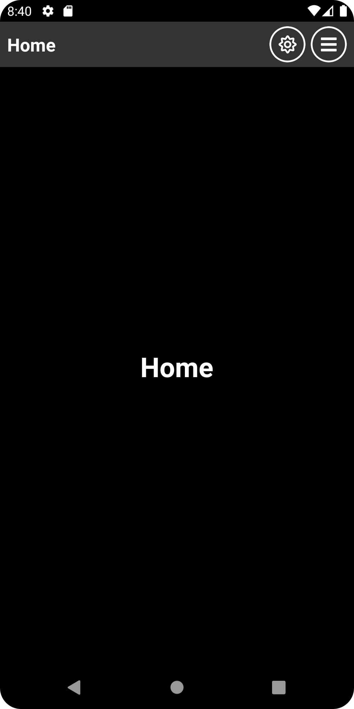
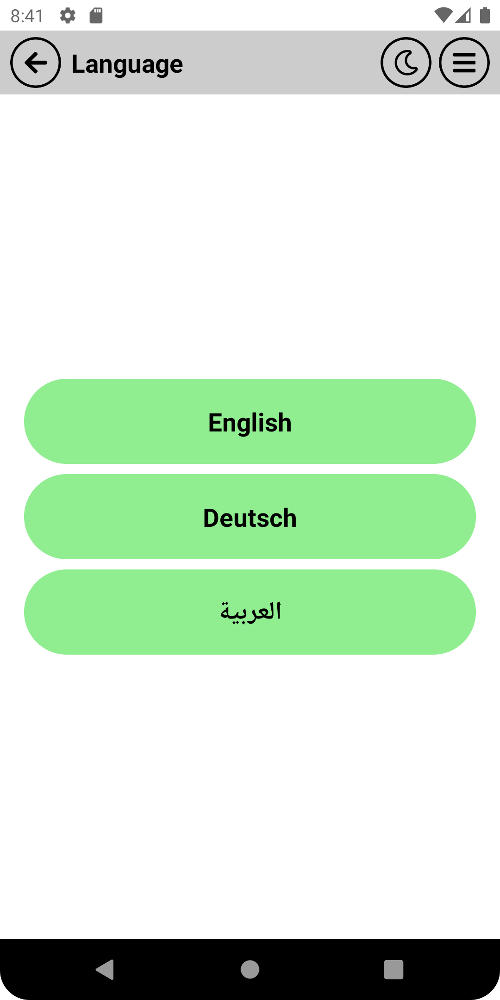
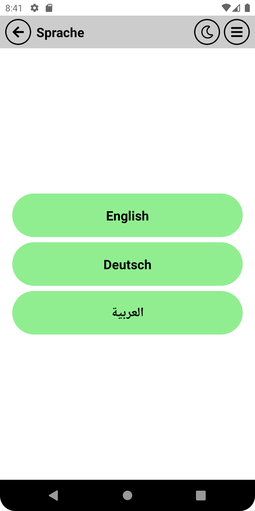
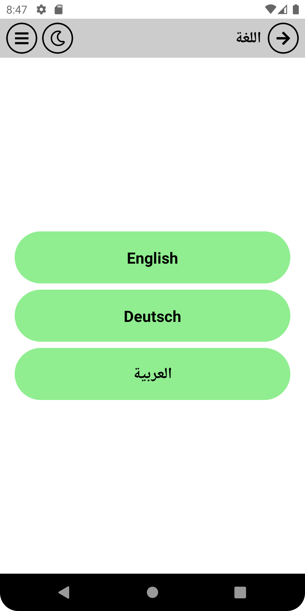

# React Native Template Best:

# A) How to use:

- Use the template:

<b>

```bash
npx react-native init --template react-native-template-best
```

<!--


-->

</b>

# B) Links:

<table>
<tr>
<th>Link Type	</th>
<th>Link</th>
</tr>

<tr>
<td>npm	</td>
<td>

https://www.npmjs.com/package/react-native-template-best

</td>
</tr>

<tr>
<td>YouTube	</td>
<td>

https://www.youtube.com/watch?v=VN2tiZ5bv7M

</td>
</tr>

<tr>
<td>GitHub	</td>
<td>

https://github.com/OmarThinks/react-native-template-best

</td>
</tr>

</table>

# C) About:

A template pre-configured with requirements for most projects for `cli` build.

# D) Technologies Used:

- React
- React Native
- Redux ToolKit
- React Navigation
- Async Storage
- i18next
- NativeWind
- Module Resolver
- TypeScript
- React Native Paper

# E) Features:

### E-1) Thememing:

This template supports light and dark themes.  
On changing the theme, the theme name is stored presistently using Async Storage, and it initialized in the Splash screen on start.

**Light Theme:**


**Dark Theme:**



### E-2) Localization:

The app supports languages, and also switching rtl or lrt.  
But if the app changes the language, and both languages have differenet directions, then the app must restart.

**English is ltr(Left to Right):**



**German is ltr(Left to Right):**



**Arabic is rtl(Right to Left):**



### E-3) Common Components:

For this application, i created the following common compoennets:

- Text
- TouchFiller
- Icon
- CircleIcon
- AppBar

### E-4) NativeWind:

Just like using TailWindCSS for React projects, NativeWind is the same as TailWindCSS but for React Native.  
The template supports TailWindCSS

### E-5) Mainlayout:

MainLayout is a HOC (Higher-Order Component) that I have created for this template.  
MainLayout reduces code redundency, and keep the code as DRY nd possible.

### E-6) Navigation and Theme Type-Safety:

<b>

```ts
import { useAppTheme } from "@theme";

// Navigation and Route
import { NativeStackNavigationProp } from "@react-navigation/native-stack";
import { RootStackParamList, navigationNames } from "@navigation";
import { RouteProp, useNavigation, useRoute } from "@react-navigation/native";

type SplashScreenProps = RouteProp<
  RootStackParamList,
  typeof navigationNames.Splash
>;

const MyComponent = () => {
  // Theme
  const colors = useAppTheme().colors;
  const theme = useAppTheme();

  // Nav
  const navigation =
    useNavigation<NativeStackNavigationProp<RootStackParamList>>();
  const route = useRoute<SplashScreenProps>();
  const params = useRoute<SplashScreenProps>().params;

  return <></>;
};

export default MyComponent;
```

### Note:

Theme type safety is for CLI an Expo.  
But navigation type safety is for CLI only, since Expo has pre-defined type safe navigational system.

</b>

# F) Motivation:

- To start projects faster, instead of spending tto much time preconfiguring everything.

# G) Todos:

- Follow up with React Native versions often to keep the template up to date.
- Remove the AppBar component, and just use the React Navogation AppBar features.
- Remove the MainLayout HOC (Higher-Order Component), and just use React Navigation features
